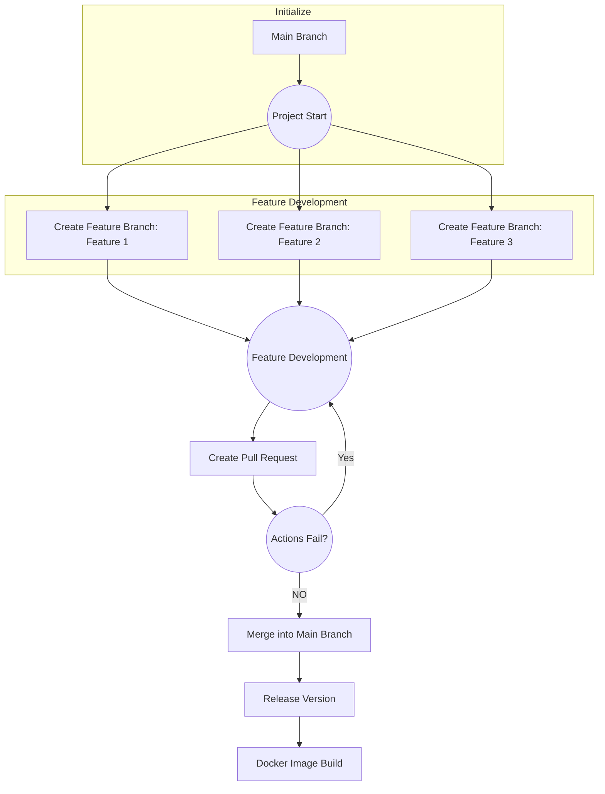

# Mockery [**UNDER-DEVELOPMENT**]

## Simple Rule based dns reverse proxy

* [X] Raw-Response
* [X] block request
* [X] update Flow
    > instead of handling request and writing response in provider
    > just handle request in provider dus making it testable
    * [X] dns provider ip fallback instead of random (Done as a side effect of changing the flow)
* [X] change provider params
* [ ] dns providers (for each rule)
* [ ] fill `README.md`
* [ ] rule grouping
* [ ] dns grouping
* [ ] DOT inward
* [ ] DOT outward
* [ ] DOH inward
* [ ] DOH outward

## Development

