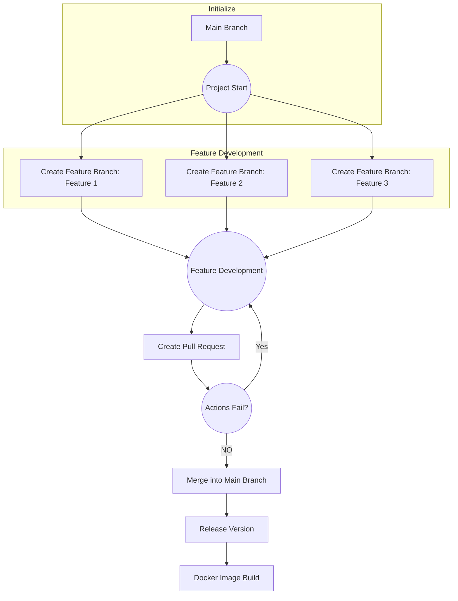

# Mockery [**UNDER-DEVELOPMENT**]

## Simple Rule based DNS reverse proxy
### v2.0.x
* [X] Raw-Response
* [X] Block request
* [X] Update Flow
    > Instead of handling requests and writing responses in the provider
    > Just handle requests in provider dus making it testable
    * [X] DNS provider ip fallback instead of random (Done as a side effect of changing the flow)
* [X] Change provider params
* [X] DNS providers (for each rule)
* [ ] Test config methods
* [ ] Fix test-log messages/levels
* [ ] Fix Docs
* [ ] Add More Tests
* [ ] Refactor the code
* [ ] check config (maybe)
* [ ] Rename Project
* [ ] Fill `README.md`
### v2.1.x
* [ ] DOT client
* [ ] DOH client
* [ ] Rule grouping
* [ ] DNS grouping
### v3.0.x
* [ ] DOT inward
* [ ] DOH inward

## Development

