# Mockery [**UNDER-DEVELOPMENT**]

## Simple Rule-Based DNS Reverse Proxy Project

## Deploy

### Using Docker hub

Located at `docker.io/fmotalleb/mockery:(tag)`

### Using GitHub registry (since v2.0.7)

Located at `ghcr.io/fmotalleb/mockery:(tag)`

### Development version

Located at `ghcr.io/fmotalleb/mockery-dev:(branch name: main,...)`

## Development contracts

* Versioning will follow the semver format.
* Versions in the format of vx.y.* will share the same configuration files without any changes relative to each other.
  * For instance, version 2.0.1 can utilize the configuration file of 2.0.0, though the reverse may not be feasible.
  * The sole exception was for v2.0.7: a keyword in the configuration file was altered (all `resolver` keys are now `resolvers`).

## Progress

### Version 2.0.x

In this version, the following tasks have been completed:

* [X] Implemented Raw-Response handling.
* [X] Enabled blocking of specific requests.
* [X] Updated the request-handling flow:
  * Instead of managing requests and composing responses within the provider, requests are now solely managed within the provider, making testing more feasible.
* [X] Implemented DNS provider IP fallback, which replaced the previous random approach (this change was a side effect of altering the flow).
* [X] Modified provider parameters as needed.
* [X] Added support for multiple DNS providers for each rule.
* [X] Test the configuration package.

However, there are some remaining tasks for version 2.0.x:

* [ ] Address and enhance log messages and levels.
* [X] configuration
* [X] rules
* [ ] utils
* [ ] entry point
* [ ] Address and enhance test messages.
* [ ] Improve project (code) documentation.
* [ ] Expand test coverage.
* [ ] Conduct code refactoring.
* [ ] Potentially review and adjust the configuration.
* [ ] Consider renaming the project to a more reasonable name.
* [ ] Populate the `README.md` file with relevant information.

### Version 2.1.x (Planned)

The upcoming version 2.1.x will introduce the following features:

* [ ] Implementation of a DOT (DNS over TLS) client. (As Resolver)
* [ ] Development of a DOH (DNS over HTTPS) client. (As Resolver)
* [ ] Introduction of rule grouping for improved organization.
* [ ] Implementation of DNS grouping to enhance management.

### Version 3.0.x (Planned)

The future version 3.0.x is expected to include the following additions:

* [ ] Integration of DOT inward capabilities. (As server)
* [ ] Implementation of DOH inward functionalities. (As server)

Please note that these tasks represent the current project status and planned developments. The project is actively evolving to incorporate these changes and improvements.

## Development

```mermaid
flowchart TB
    subgraph "Master Channel"
        A((Main Branch)) -->|Start| B[Release Tag]
    end
    subgraph "CD"
        B -->|Build Image| M[Docker Image Build]
    end
    subgraph "Feature Development"
        A --> C[Create Branch Per Feature]
        C -->|Create| F((Feature Development))

        F -->|Develop| G[Create Pull Request]
        G -->|Pass?| H((Actions Pass?))
        H -->|No| F
        H -->|Yes| A
    end

    %% Descriptions
    style B fill:#44bd32,stroke:#333,stroke-width:2px
    style M fill:#192a56,stroke:#333,stroke-width:2px
    style C fill:#c23616,stroke:#333,stroke-width:2px
    style A stroke:#333,stroke-width:2px
    style F stroke:#333,stroke-width:2px
    style G stroke:#333,stroke-width:2px
    style H stroke:#333,stroke-width:2px
    style B stroke:#333,stroke-width:2px
    style M stroke:#333,stroke-width:2px
    style C stroke:#333,stroke-width:2px
```

